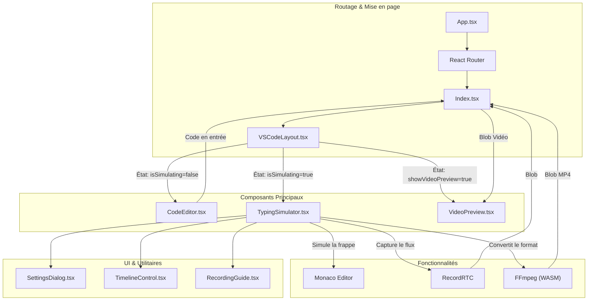

# Analyse de l'Architecture : Code Video Forge

Ce document fournit une vue d'ensemble de l'architecture de l'application **Code Video Forge**.

## Vue d'ensemble

**Code Video Forge** est une application React conçue pour créer des enregistrements vidéo de code en train d'être tapé, simulant une session de "live coding". Elle permet aux utilisateurs de saisir du code, de configurer la vitesse de frappe et les effets, d'enregistrer la simulation et d'exporter le résultat sous forme de fichier vidéo (WebM ou MP4).

## Stack Technologique

- **Framework** : React (Vite)
- **Langage** : TypeScript
- **Style** : Tailwind CSS, Shadcn UI
- **Éditeur** : Monaco Editor (`@monaco-editor/react`)
- **Enregistrement** : RecordRTC
- **Traitement Vidéo** : FFmpeg (WASM) (`@ffmpeg/ffmpeg`)
- **Gestion d'État** : React `useState`, `useEffect` (État local)
- **Routage** : React Router DOM

## Diagramme d'Architecture

Le diagramme Mermaid suivant illustre la structure des composants de haut niveau et le flux de données.

## Détails des Composants

### 1. `Index.tsx` (Orchestrateur)
- **Rôle** : Conteneur principal et gestionnaire d'état.
- **Responsabilités** :
    - Gère le contenu du `code`.
    - Bascule entre les vues `CodeEditor`, `TypingSimulator` et `VideoPreview`.
    - Gère le `Blob` vidéo final et l'URL de prévisualisation.

### 2. `CodeEditor.tsx` (Entrée)
- **Rôle** : Interface initiale de saisie de code.
- **Responsabilités** :
    - Fournit un éditeur Monaco pour que les utilisateurs collent ou écrivent du code.
    - Permet la configuration des paramètres initiaux avant la simulation.

### 3. `TypingSimulator.tsx` (Moteur Central)
- **Rôle** : Simule la frappe et gère l'enregistrement.
- **Responsabilités** :
    - **Simulation** : Met à jour le code affiché dans l'éditeur Monaco caractère par caractère (ou selon `displayEffect`).
    - **Enregistrement** : Utilise `RecordRTC` pour capturer l'écran/canvas.
    - **Conversion** : Utilise `ffmpeg` pour convertir les enregistrements WebM en MP4.
    - **Contrôles** : Lecture/Pause, Vitesse, Thème, Police, etc.

### 4. `VideoPreview.tsx` (Sortie)
- **Rôle** : Prévisualise et télécharge le résultat.
- **Responsabilités** :
    - Lit la vidéo enregistrée.
    - Fournit les options de téléchargement et de suppression.

## Flux de Données

1.  **Phase d'Entrée** : L'utilisateur saisit du code dans `CodeEditor`. Le code est stocké dans l'état de `Index`.
2.  **Phase de Simulation** : L'utilisateur passe en mode "Simulation". `Index` transmet le `code` à `TypingSimulator`.
3.  **Phase d'Enregistrement** :
    - L'utilisateur lance l'enregistrement.
    - `TypingSimulator` capture le flux d'écran via `navigator.mediaDevices.getDisplayMedia`.
    - `RecordRTC` enregistre le flux.
4.  **Phase de Traitement** :
    - À l'arrêt, `RecordRTC` produit un Blob WebM.
    - Si MP4 est sélectionné, `FFmpeg` traite le Blob WebM dans le navigateur (WASM).
5.  **Phase de Sortie** :
    - Le Blob final est renvoyé à `Index`.
    - `Index` bascule vers `VideoPreview` pour afficher le résultat.
